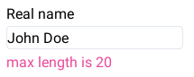
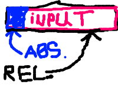
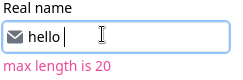
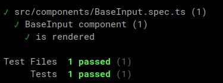
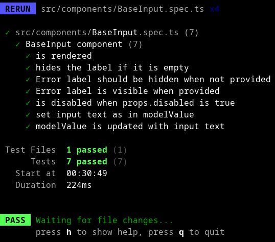

In this post, we'll create an input component for vue 3.

<!--more-->

## Stack

We will use these packages:

- [Vite](https://vitejs.dev/)
- [Vue 3](https://vuejs.org/)
- [Tailwind CSS](https://tailwindcss.com/)
- [Vitest](https://vitest.dev)
- [Vue test utils](https://test-utils.vuejs.org)

You can create a starter project with Vite easily:

```
npm create vite@latest base-input-component -- --template vue-tsc
```

If you have any troubles, checkout the "Getting started" section in the
[docs](https://vitejs.dev/guide/).

Then, install TailwindCSS:

```
> npm install -D tailwindcss postcss autoprefixer
> npx tailwindcss init -p
```

Vite starter projects come with the `style.css` file.
Replace its content with these lines:

```
@tailwind base;
@tailwind components;
@tailwind utilities;
```

And finally, update `tailwind.config.json` file:

```
/** @type {import('tailwindcss').Config} */
export default {
  content: [
    "./index.html",
    "./src/**/*.{vue,js,ts,jsx,tsx}",
  ],
  theme: {
    extend: {},
  },
  plugins: [],
}
```

## What we want to create

We're going to create a simple component which will wrap
an input element and provide some useful features that we almost
always want from an input field in any form, particulary:

- A label that will be displayed above the input field
- An input element itself
- An error label, so we can display error message for the field

## Base wrapper

First of all, let's just wrap an input element in a component.
Create a `BaseInput.vue` file in the `components` directory:

*BaseInput.vue*:

```
<script setup lang="ts">
withDefaults(defineProps<{
  modelValue?: string
}>(), {
  modelValue: ''
})

const emit = defineEmits<{
  (evt: 'update:modelValue', val: string): void
}>()

function onInput(e: Event) {
  const target = e.target as HTMLInputElement

  emit('update:modelValue', target.value)
}
</script>

<template>
  <input
    :value="modelValue"
    type="text"
    @input="onInput"
  >
</template>
```

Now I'll explain what we have done in the code above.

Our component have only one single input element for now:

```
<input
  :value="modelValue"
  type="text"
  @input="onInput"
>
```

What we want is to use our `BaseInput` like this:

```
const inputText = ref('')
...
<BaseInput
  v-model="inputText"
/>
```

So when we change the value of the `inputText` variable,
the text in an input field also changes, and when the input's
value is changed, the `inputText` variable is synced with the typed text.

To do so, we need to know how `v-model` directive works in Vue.
There'is a [dedicated page](https://vuejs.org/guide/components/v-model.html)
in the docs for this.

We bind component's `modelValue` to the input's value,
so everytime when `modelValue` is changed, input's
text will be in sync with it. Besides this, we need to
update `modelValue` when the text in the input field is changed
by the user. Since **component's props are immutable**, we
can't directly update `modelValue`. Instead, we emit
`update:modelValue` event with the text in the input field.

It's all done in the `onInput` function:

```
function onInput(e: Event) {
  const target = e.target as HTMLInputElement

  emit('update:modelValue', target.value)
}
```

To be able to emit events, we should declare each of
them:

```
const emit = defineEmits<{
  (evt: 'update:modelValue', val: string): void
}>()
```

**Important things you should understand now**:

1. You cannot modify component's props
2. When you use a component with `v-model="val"` pattern, it's actually
   expanded by Vue to the `:modelValue="val"` and `@update:modelValue="e => val = e"`


*App.vue*:

```
<script setup lang="ts">
import { ref, watchEffect } from 'vue'
import BaseInput from './components/BaseInput.vue'

const text = ref('')

// For demonstration only
watchEffect(() => {
  console.log(text.value)
})
</script>

<template>
  <div>
    <BaseInput v-model="text" />
  </div>
</template>
```

This code is pretty straightforward - we're  importing required dependencies,
creating a ref that will serve as a `v-model`, and using
`watchEffect` for demonstration of how our `v-model` is being changed - you
can open a dev console and to see the logs of `text`'s values.

## Label and Error label

Now let's add a field label and a label for the error message.
We will pass them as props, so first thing we can do is to declare them:

```
withDefaults(defineProps<{
  modelValue?: string
  label?: string
  error?: string
}>(), {
  modelValue: ''
})
```

We made them optional, so we have to keep in mind that
if they're optional, we should correctly handle the cases when
a value for one of these fields isn't provided. For labels in an
input component, it's ok to just hide them:

```
<template>
  <div>
    <span
      v-show="label"
      class="block text-sm mb-1"
    >
      {{ label }}
    </span>
    <input
      :value="modelValue"
      type="text"
      @input="onInput"
    >
    <span
      v-show="error"
      class="block text-pink-500 text-sm mt-1"
    >
      {{ error }}
    </span>
  </div>
</template>
```

Please note how we've added gaps between the input and labels - the top label has
`margin-bottom` property, and the bottom label has the `margin-top` property, so when
one of the labels is hidden, a gap disappeares. If we had applied `margin-top`
and `margin-bottom` properties to the input element itself, the gaps still would have
been in the component. We also used a *block* class to make our spans act like a
block DOM node. Another possible solution here is to use flexbox.

## Disabled state

To make an input field disabled, we'll just set corresponding html attribute
in the input field:


```
withDefaults(defineProps<{
  modelValue?: string
  label?: string
  error?: string
  disabled?: boolean
}>(), {
  modelValue: '',
  disabled: false,
})
```

```
<input
  :value="modelValue"
  type="text"
  :disabled="disabled"
  @input="onInput"
>
```

## Add some styling

Let's make input field more attractive:

```
<input
  class="p-1 focus:ring-2 focus:ring-blue-300
    focus:outline-none border border-slate-200
    rounded"
  :value="modelValue"
  type="text"
  :disabled="disabled"
  @input="onInput"
>
```

Utility classes were splitted into multiple lines for the sake of readability on this website. Usually you
write these classes in a single line.

We can display a label and an error:

*App.vue*:

```
...
<BaseInput
  v-model="text"
  label="Real name"
  error="max length is 20"
/>
...
```

And the component look like this:



## Icons

Now we need to add support for icons inside our input.
We will use slots for this task.
Since part of the input field will be
overlapped with the icon (because we will use absolute positioning), we
 need to "shift" the place where
typing starts if the slot for the icon is not empty, and remove
this shift when the icon was not provided.

This is the modified version of our input field. It's a replacement for
`<input...` tag:

```
<div class="relative">
  <input
    class="focus:ring-2 focus:ring-blue-300
      focus:outline-none border border-slate-200
      rounded text-sm"
    :class="[$slots.prepend ? 'pl-6' : '']"
    :value="modelValue"
    type="text"
    :disabled="disabled"
    @input="onInput"
  >
  <div class="absolute left-0 top-0 h-full p-1 flex items-center justify-center">
    <div class="h-4 w-4">
      <slot name="prepend" />
    </div>
  </div>
</div>
```

Let's break it down.

First of all, we wrapped our input tag in a `div` with relative
positioning. Inside this container, we have an input field and another
one div block, but this time with absolute positioning. This absolute
block has `left-0`, `top-0` and `h-full` classes. It means that the top side
of it will be at the same position as the top side of its parent with
relative positioning. Same for its left side. `h-full` class stretches block
to the 100% of the parent. If you don't undestand, I've got you covered,
here's an illustration of how it works:



Now let's take a  closer look at the input element. Besides static CSS classes, we use
this one: `:class="[$slots.prepend ? 'pl-6' : '']"`. This class adds left padding
**when prepend icon is presented**, so text in the input won't be overlapped with
an icon.

This is how we can add an icon:

```
<BaseInput label="Real name" error="max length is 20" v-model="text" class="m-2">
      <template v-slot:prepend>
        <svg
          class="w-4 h-4 text-gray-500 dark:text-gray-400"
          aria-hidden="true"
          xmlns="http://www.w3.org/2000/svg"
          fill="currentColor"
          viewBox="0 0 20 16"
        >
          <path d="m10.036 8.278 9.258-7.79A1.979 1.979 0 0 0 18 0H2A1.987 1.987 0 0 0 .641.541l9.395 7.737Z"/>
          <path d="M11.241 9.817c-.36.275-.801.425-1.255.427-.428 0-.845-.138-1.187-.395L0 2.6V14a2 2 0 0 0 2 2h16a2 2 0 0 0 2-2V2.5l-8.759 7.317Z"/>
        </svg>
      </template>
    </BaseInput>
```

And this is how our component look now:



*Yes, I know, I used a wrong icon, but it's not so important here.*

## Testing

Usually tests are being written in parallel with component implementation - you
write test for a specific testcase, it fails because the feature isn't implemented
yet, and then you make the testcase pass by implementig the feature in the component.
We'll use [vitest](https://vitest.dev) and [vue-test-utils](https://test-utils.vuejs.org)
for testing.

### Install vue-test-utils and vitest

Install vue-test-utils:

```
npm install --save-dev @vue/test-utils
```

And vitest:

```
npm install -D vitest
```

### First test

Usually tests have `.spec.ts` or `.test.ts` extension, while the filename
is the same as the filename of the tested component/module. We will use `.spec.ts`.

First, create the `BaseInput.spec.ts` file with this content:

```
import { describe, it, expect } from 'vitest'
import { mount } from '@vue/test-utils'
import BaseInput from './BaseInput.vue'

describe('BaseInput component', () => {
  it('is rendered', () => {
    const wrapper = mount(BaseInput)


    expect(wrapper.find('[data-test="input-wrapper"]').exists()).toBe(true)
  })
})
```

The most interesting part here is how we're trying to check whether our component is
rendered. We search a DOM node by a "data-test" attribute.
It's [one of the global attributes](https://developer.mozilla.org/en-US/docs/Web/HTML/Global_attributes/data-*)
Because we didn't add any "data" attributes to the component's layout, we need to fix that:

*BaseInput.vue*:

```
<template>
  <div data-test="input-wrapper">
```

*Wrapper has [a lot](https://test-utils.vuejs.org/api/#wrapper-methods) of
methods which may be useful for testing. It's  also highly recommended to
go through [a crash course](https://test-utils.vuejs.org/guide/essentials/a-crash-course.html)
to get familiar with main concepts of testing with vue test utils.*


Now, it's time to run our test. All we need to do is just run
vitest:

```
npx vitest
```

Result:

```
⎯⎯⎯⎯⎯⎯⎯⎯ Failed Tests 1 ⎯⎯⎯⎯

FAIL  src/components/BaseInput.spec.ts > BaseInput component > is rendered
ReferenceError: document is not defined
 ❯ Module.mount node_modules/@vue/test-utils/dist/vue-test-utils.esm-bundler.mjs:8305:14
 ❯ src/components/BaseInput.spec.ts:7:21
      5| describe('BaseInput component', () => {
      6|   it('is rendered', () => {
      7|     const wrapper = mount(BaseInput)
       |                     ^
      8|
      9|
```

Sadly, vitest throws an "ReferenceError: document is not defined" error.
To be able to test components, vitest should somehow emulate browser's
behaviour, and we can choose from [a few possible options](https://vitest.dev/guide/environment.html#test-environment).
We'll use "jsdom" package, so our `vite.config.ts` should be like this:

```
import { defineConfig } from 'vite'
import Vue from '@vitejs/plugin-vue'

export default defineConfig({
  plugins: [
    Vue(),
  ],
  test: {
    globals: true,
    environment: 'jsdom',
  },
})
```

After execution of the `vitest` command we will be promted to
install the jsdom package. Press "y" and enjoy our first passing test!




### Label

When the label is empty, it should be hidden:

```
it('hides the label if it is empty', () => {
  const wrapper = mount(BaseInput, {
    props: {
      label: '',
    }
  })


  expect(wrapper.find('[data-test="input-label"]').isVisible()).toBe(false)
})
```

**ATTENTION!!!** We hide input label with `v-show` directive, which adds
`display:none` CSS style to the element, but it still exists in the DOM tree.
Therefore, we use `isVisible` method, and not `exists`.


### Error label

Error label should be hidden if not provided:

```
it('Error label should be hidden when not provided', () => {
  const wrapper = mount(BaseInput)


  expect(wrapper.find('[data-test="input-error"]').isVisible()).toBe(false)
})
```

Error label is visible when the `props.error` is provided:

```
it('Error label is visible when provided', () => {
  const wrapper = mount(BaseInput, {
    props: {
      error: 'error label',
    }
  })


  expect(wrapper.find('[data-test="input-error"]').text()).toBe('error label')
})
```

### Disabled state

When our input component is disabled, it shouldn't update
our modelValue and also the input element must have a disabled attribute.

```
it('is disabled when props.disabled is true', async () => {
  const wrapper = mount(BaseInput, {
    props: {
      modelValue: '',
      'onUpdate:modelValue': (e) => wrapper.setProps({ modelValue: e }),
      disabled: true,
    }
  })

  await wrapper.get('[data-test="input-field"]').setValue('text')
  expect(wrapper.props('modelValue')).toBe('')
})
```

### modelValue update

V-model's value is displayed in the input field from the start:

```
it('set input text as in modelValue', () => {
  const wrapper = mount(BaseInput, {
    props: {
      modelValue: 'text',
    }
  })

  wrapper.find('[data-test="input-field"]').element
  expect((wrapper.find('[data-test="input-field"]').element as HTMLInputElement).value).toBe('text')
})
```

Binded `v-model` is updated when text is changed in the
input field:

```
it('modelValue is updated with input text', async () => {
  const wrapper = mount(BaseInput, {
    props: {
      modelValue: '',
      'onUpdate:modelValue': (e) => wrapper.setProps({ modelValue: e })
    }
  })

  await wrapper.get('[data-test="input-field"]').setValue('text')
  expect(wrapper.props('modelValue')).toBe('text')
})
```

Important thing here is that we should wait for end of `setValue` execution,
so DOM will be updated before our next assertions.
Read more [here](https://test-utils.vuejs.org/api/#setvalue).

All of our tests passed, good job!


