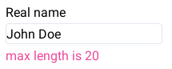
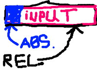
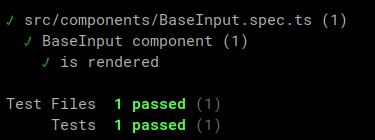

## Stack

We will use these packages:

- Vite
- Vue 3
- Tailwind CSS

You can create a starter project with Vite easily,
checkout the docs.


## What we want to create

We're going to create a simple component which will wrap
`input` tag and provide some useful features that we almost
always want from the input field in any form. It will contain:

- A label that will be displayed above the input field
- An input element itself
- An error label, so we can display error message for the field

## Base wrapper

First of all, let's just wrap input element in a component.

*BaseInput.vue*:

```
<script setup lang="ts">
withDefaults(defineProps<{
  modelValue?: string
}>(), {
  modelValue: ''
})

const emit = defineEmits<{
  (evt: 'update:modelValue', val: string): void
}>()

function onInput(e: Event) {
  const target = e.target as HTMLInputElement

  emit('update:modelValue', target.value)
}
</script>

<template>
  <input
    :value="modelValue"
    type="text"
    @input="onInput"
  >
</template>
```

Now I'll explain what we did in the code above.
Our component have only one single input element for now:

```
<input
  :value="modelValue"
  type="text"
  @input="onInput"
>
```

What we want is to use our BaseInput like this:

```
const inputText = ref('')
...
<BaseInput
  v-model="inputText"
/>
```

So when we change the value of `inputText` variable,
it will appear in the input field, and when the input's
value is changed, the `inputText` is synced with typed text.

To do so, we need to know how `v-model` directive works in Vue.
There'is a [dedicated page](https://vuejs.org/guide/components/v-model.html)
in the docs for this.

We bind component's `modelValue` to the input's value,
so everytime `modelValue` is changed, input's displayed
text will be in sync with it. Besides this, we need to
update modelValue when text in the input field is changed
by the user. Since component's props are immutable, we 
can't directly update `modelValue`. Instead, we emit
`update:modelValue` event with the text in the input field.
This code is iside `onInput` function:

```
function onInput(e: Event) {
  const target = e.target as HTMLInputElement

  emit('update:modelValue', target.value)
}
```

To be able to emit events, we should declare each of
them: 

```
const emit = defineEmits<{
  (evt: 'update:modelValue', val: string): void
}>()
```

**There are important things you should understand now**:

1. You cannot modify component's props
2. When you use a component with `v-model="val"` pattern, it's actually
   expanded by Vue to the `:modelValue="val"` and `@update:modelValue="e => val = e"`


*App.vue*:

```
<script setup lang="ts">
import { ref, watchEffect } from 'vue'
import BaseInput from './components/BaseInput.vue'

const text = ref('')

// For demonstration only
watchEffect(() => {
  console.log(text.value)
})
</script>

<template>
  <div>
    <BaseInput v-model="text" />
  </div>
</template>
```

This code is pretty straightforward - we import required dependencies,
creating a ref that will serve as a `v-model`, and use 
`watchEffect` for demonstration of how our v-model is being changed - you
can open a dev console and see the logs of `text`'s values.

## Label and Error label

Now let's add a field label, and a label for the error message.
We will pass them as props, so first thing we can do is to declare them:

```
withDefaults(defineProps<{
  modelValue?: string
  label?: string
  error?: string
}>(), {
  modelValue: ''
})
```

We made them optional, so we have to keep in mind that
if they're optional, we should correctly handle the cases when
a value for one of these fields isn't provided. For labels in an
input component, it's ok just to hide them:

```
<template>
  <div>
    <span
      v-show="label"
      class="block text-sm mb-1"
    >
      {{ label }}
    </span>
    <input
      :value="modelValue"
      type="text"
      @input="onInput"
    >
    <span
      v-show="error"
      class="block text-pink-500 text-sm mt-1"
    >
      {{ error }}
    </span>
  </div>
</template>
```

Please note how we've added a gaps between an input and labels - top label has
`margin-bottom` property, and bottom label has the `margin-top` property, so when
one of the labels is hidden, the gap disappeares. If we had applied `margin-top`
and `margin-bottom` properties to the input element itself, the gaps still would have
been in the component. We also used a *block* class to make our spans act like a
block DOM node. Another possible solution here is to use flexbox.

## Disabled state

To make an input field disabled, we'll just set corresponding html attribute
in the input field:


```
withDefaults(defineProps<{
  modelValue?: string
  label?: string
  error?: string
  disabled?: boolean
}>(), {
  modelValue: '',
  disabled: false,
})
```

```
<input
  :value="modelValue"
  type="text"
  :disabled="disabled"
  @input="onInput"
>
```

## Add some styling

Let's make input field more attractive:

```
<input
  class="focus:ring-2 focus:ring-blue-300
    focus:outline-none border border-slate-200
    rounded"
  :value="modelValue"
  type="text"
  :disabled="disabled"
  @input="onInput"
>
```

Utility classes were splitted into multiple lines for the sake of readability on this website. Usually you
write these classes in a single line.

Now our component look like this:



## Icons

Now we're going to add support for icons inside our input component.
Those icons will help a user to recognize the purpose of the field. 
There're a few possible ways to add icons, but we will use slots.
Our icon should be inside an input field, and we'll use absolute
positioning for this. Since part of the input field will be
overlapped with the icon, we need to "shift" the place where
typing starts if the slot for the icon is not empty, and remove
this shift when icon is not provided.

This is modified version of our input field. It's a replacement for
`<input...` tag:

```
<div class="relative">
  <input
    class="focus:ring-2 focus:ring-blue-300
      focus:outline-none border border-slate-200
      rounded text-sm"
    :class="[$slots.prepend ? 'pl-6' : '']"
    :value="modelValue"
    type="text"
    :disabled="disabled"
    @input="onInput"
  >
  <div class="absolute left-0 top-0 h-full p-1 flex items-center justify-center">
    <div class="h-4 w-4">
      <slot name="prepend" />
    </div>
  </div>
</div>
```

Let's break it down.

First of all, we wrapped our input tag in a `div` which has relative
positioning. Inside this container, we have an input field and another
one div block, but this time with absolute positioning. This absolute
block has `left-0`, `top-0` and `h-full` classes. It means that the top side
of this block will be at the same position as the top side of its parent with
relative positioning. Same for its left side. `h-full` class stretches block's
height to the 100% of the parent. If you don't undestand, I've got you covered,
here's an illustration of how it's work:



Icon should be verticaly centered inside the input field, and it's the same
as to center an icon inside the absolute positioned block (blue). For this,
we turned this div into a flexbox container and added another one div with fixed height and width inside.
This div is centered vertically, and it is the container for our icon, which ideally should
have the same width and height. Inside this div we've added a named slot.

Now let's look closer at the input element. Besides static CSS classes, we use
this one: `:class="[$slots.prepend ? 'pl-6' : '']"`. This class adds left padding
**when prepend icon is presented**, so text in the input won't be overlapped with
an icon.

This is how we can add an icon:

```
<BaseInput label="Real name" error="max length is 20" v-model="text" class="m-2">
      <template v-slot:prepend>
        <svg
          class="w-4 h-4 text-gray-500 dark:text-gray-400"
          aria-hidden="true"
          xmlns="http://www.w3.org/2000/svg"
          fill="currentColor"
          viewBox="0 0 20 16"
        >
          <path d="m10.036 8.278 9.258-7.79A1.979 1.979 0 0 0 18 0H2A1.987 1.987 0 0 0 .641.541l9.395 7.737Z"/>
          <path d="M11.241 9.817c-.36.275-.801.425-1.255.427-.428 0-.845-.138-1.187-.395L0 2.6V14a2 2 0 0 0 2 2h16a2 2 0 0 0 2-2V2.5l-8.759 7.317Z"/>
        </svg>
      </template>
    </BaseInput>
```

And this is how our component look now:


*Yes, I know, I used a wrong icon, but it's not so important here.*

## Testing

Usually tests are being written in parallel with component implementation - you
write test for a specific testcase, it falls because the feature isn't implemented
yet, and then you make the testcase pass by implementig the feature in the component.
We'll use [vitest](https://vitest.dev) and [vue-test-utils](https://test-utils.vuejs.org)
for testing. 

### Install vue-test-utils and vitest

Install vue-test-utils:

```
npm install --save-dev @vue/test-utils
```

And vitest:

```
npm install -D vitest
```

### First test

Usually tests have `.spec.ts` or `.test.ts` extension, while the filename
is the same as the filename of the tested component/module. We will use `.spec.ts`.

First, create the `BaseInput.spec.ts` file with this content:

```
import { describe, it, expect } from 'vitest'
import { mount } from '@vue/test-utils'
import BaseInput from './BaseInput.vue'

describe('BaseInput component', () => {
  it('is rendered', () => {
    const wrapper = mount(BaseInput)


    expect(wrapper.find('[data-test="input-wrapper"]').exists()).toBe(true)
  })
})
```

The most interesting part here is how we're trying to check whether our component is
rendered. We search a DOM node by "data-test" attribute. Because we didn't
add any "data" attributes to the component's layout, we need to fix that:

*BaseInput.vue*:

```
<template>
  <div data-test="input-wrapper">
```

*Wrapper has [a lot](https://test-utils.vuejs.org/api/#wrapper-methods) of
methods which may be useful for testing. It's  also highly recommended to
go through [a crash course](https://test-utils.vuejs.org/guide/essentials/a-crash-course.html)
to get familiar with main concepts of testing with vue test utils.*


Now, it's time to run our test. All we need to do is just run
vitest:

```
npx vitest
```

Sadly, vitest throws an "ReferenceError: document is not defined" error. 
To be able to test components, vitest should somehow emulate browser's
behaviour, and we can choose from [a few possible options](https://vitest.dev/guide/environment.html#test-environment).
We'll use "jsdom" package, so our `vite.config.ts` should be like this:

```
import { defineConfig } from 'vite'
import Vue from '@vitejs/plugin-vue'

export default defineConfig({
  plugins: [
    Vue(),
  ],
  test: {
    globals: true,
    environment: 'jsdom',
  },
})
```

After execution of the `vitest` command we will be promted to
install jsdom package. Press "y" and enjoy our first passing test!




Here we imported required dependencies and created a stub for our first test
case. This test checks that our component just rendered, and nothing more.

### Label

### Error label

### Disabled state

### modelValue update
