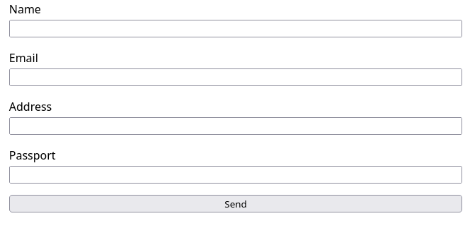
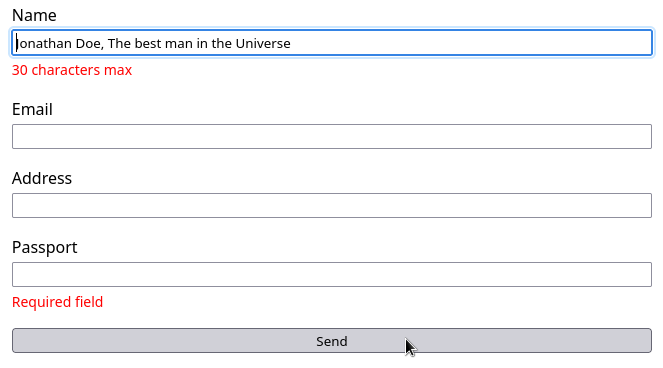

## TL;DR

Add a `data-error` attribute to an element if it has an error and then
focus on it with [querySelector](https://developer.mozilla.org/ru/docs/Web/API/Document/querySelector) +
[focus()](https://developer.mozilla.org/en-US/docs/Web/API/HTMLElement/focus).

## Project setup

We'll use vite + vanilla ts for our project:

```
npm create vite@latest my-vue-app -- --template vanilla-ts
```

Now we need some cleanup - remove all content from the
`styles.css` file as well as from the `main.ts`.

## Create a form

First, let's add markup for our form (`main.ts` file):

```
import './style.css'

document.querySelector<HTMLDivElement>('#app')!.innerHTML = `
<div class="personal-form">
  <div class="text-input">
    <label for="name">Name</label>
    <input id="name" type="text">
    <div class="error-label" id="error-name"></div>
  </div>

  <div class="text-input">
    <label for="email">Email</label>
    <input id="email" type="text">
    <div class="error-label" id="error-email"></div>
  </div>

  <div class="text-input">
    <label for="address">Address</label>
    <input id="address" type="text">
    <div class="error-label" id="error-address"></div>
  </div>

  <div class="text-input">
    <label for="passport">Passport</label>
    <input id="passport" type="text">
    <div class="error-label" id="error-passport"></div>
  </div>
  <button id="send"> Send </button>
</div>
`
```

And this is our css (`style.css` file):

```
:root {
  font-family: Inter, system-ui, Avenir, Helvetica, Arial, sans-serif;
  line-height: 1.5;
  font-weight: 400;
}

.text-input {
  display: flex;
  flex-direction: column;
  gap: 4px;
}

.personal-form {
  display: flex;
  flex-direction: column;
  max-width: 70ch;
  margin: 0 auto;
  gap: 1rem;
}

.error-label {
  color: red;
  font-size: 14px;
}

.error-label:empty {
  display: none;
}
```

The most important thing here is the `error-label` class - we hide
error blocks if they're empty( with the help of the [empty](https://developer.mozilla.org/en-US/docs/Web/CSS/:empty)
pseudo-class).

Now our page looks this way:



### Define data structure

We store each field's value in its own variable:

```
let name = ''
let email = ''
let address = ''
let passport = ''
```

Errors are stored in a single object:

```
const errors = {
  name: '',
  email: '',
  address: '',
  passport: '',
}
```

We need to update our variables' values when text
in fields is changed:

```
function updateValue(inputId, cb: (value: string) => void) {
  document.getElementById(inputId).addEventListener('input', (e: Event) => {
    const value = (e.target as HTMLInputElement).value
    cb(value)
  })
}
```

This function adds a listener to the input's `input` event and we exute
it for each of our fields:

```
updateValue('name', (value) => name = value)
updateValue('email', (value) => email = value)
updateValue('address', (value) => address = value)
updateValue('passport', (value) => passport = value)
```

When the text in a field is changed, a callback function is executed,
which in its turn assigns this value to a corresponding variable.

And finally, code that is responsible for the form's logic:

```
function onSubmit() {
  validate()
  displayErrors()
  focusOnError()
}

document.getElementById('send').addEventListener('click', onSubmit)
```

### Add validation

Our validation logic lives in the `validate` function:

```
function validate() {
  // First of all, reset all error messages
  for (const key in errors)
    errors[key] = ''

  if (!name.length)
    errors.name = 'Required field'
  else if (name.length > 30)
    errors.name = '30 characters max'

  if (!passport.length)
    errors.passport = 'Required field'
  else if (passport.length !== 13)
    errors.passport = 'Pasport id should be 13 characters long'
}
```

It validates only two fields, but that is enough for the
demonstration. You can read article about validation with
the help of the zod framework [here](https://proj11.com/posts/zod-validation/).

### Display errors

After our form's data is validated,  it's time
to display validation errors if there are any.
The algorithm is simple: we are
iterating over the `errors` object and updating
inner text of the error labels with. Each error label's id
contains field name (`error-name`, `error-passport`, `error-email` etc),
so we can rich them with `document.getElementById` function.

Besides that, we are adding a `data-error` attribute to the **input fields
which are invalid**.

```
function displayErrors() {
  for (const key in errors) {
    setErrorValue(key, errors[key])

    if (errors[key])
      document.getElementById(key)?.setAttribute('data-error', errors[key])
    else
      // Don't forget to remove attribute from the input field if its value
      // is correct
      document.getElementById(key)?.removeAttribute('data-error')
  }
}
```

`setErrorValue` function searches for error label
and updates its text:

```
function setErrorValue(field: string, error: string) {
  const el = document.getElementById(`error-${field}`)
  if (el)
    el.innerText = error
}
```

### Focus on error

We use `document.querySelector` to get *the first element
in the DOM tree with `data-error` attribute and set focus on it*:

```
function focusOnError() {
  document.querySelector('[data-error]')?.focus()
}
```

That's all, now, on submit, focus will be set on the first
field with an invalid value:



## Pros and cons

+ Framework-agnostic, can be used with vanilla JS
- Won't work if html has non-default order of elements (because
  `querySelector` returns the first matched element)
