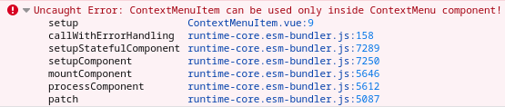

The problem: you want to make sure that a component is
placed inside some other component.
<!--more-->
The reason why you may want to do this is that your component has no sense
when used outside its parent. For example:

```
<ContextMenu>
  <ContextMenuItem icon="home-icon" text="Home" />
  <ContextMenuItem icon="cut-icon" text="Cut" />
  <ContextMenuItem icon="paste-icon" text="Paste" />
</ContextMenu>
```

Here, the `ContextMenuItem` is usable only as a "brick" of the `ContextMenu`.

In such cases, you can use [provide/inject](https://vuejs.org/guide/components/provide-inject.html):

1. Provide a value in `ContextMenu`
2. Inject the value in `ContextMenuItem`. If it's not defined, throw an error.

## Example

As usual, create an empty vite + vue + typescript project:

```
npm create vite@latest parent-component -- --template vue-tsc
```

First of all, we need a key for provide/inject functinos, so let's add it.
Create the `key.ts` file in the root of the project with this content:

```
import type { InjectionKey } from 'vue'
export const key = Symbol() as InjectionKey<string>
```

Then, in the `components` directory, create a `ContextMenu.vue` file:

```
<script setup lang="ts">
import { provide, inject } from 'vue'
import { key } from '../key'

provide(key, 'value')
</script>

<template>
  <ul>
    <slot />
  </ul>
</template>
```

Then, create a `ContextMenuItem.vue` file:

```
<script setup lang="ts">
import { inject } from 'vue'
import { key } from '../key'

const val = inject(key)

if (!val)
  throw new Error('ContextMenuItem can be used only inside ContextMenu component!')
</script>

<template>
  <li> Menu Item </li>
</template>
```

And finally, let's show our `ContextMenu` component in the `App.vue`:

```
<script setup lang="ts">
import ContextMenu from './components/ContextMenu.vue'
import ContextMenuItem from './components/ContextMenuItem.vue'
</script>

<template>
  <div>
    <ContextMenu>
      <ContextMenuItem />
      <ContextMenuItem />
      <ContextMenuItem />
    </ContextMenu>
  </div>
</template>
```

Now, on our main page, we'll see three "Menu item" strings, one per each `ContextMenuItem`.
Open dev console, and make sure you don't see any errors or warnings.

Everything works as expected - `ContextMenuItem` is inside `ContextMenu`. But if we
remove `ContextMenu` component, our dev console will show us an error:




## Should I always check for such situations?

Of course no. Check for the parent component if you really
need this. If you're in doubt, I consider to
update your documentation instead of adding more JS code to your
project.

## References

- [Headless UI library](https://headlessui.com/)
