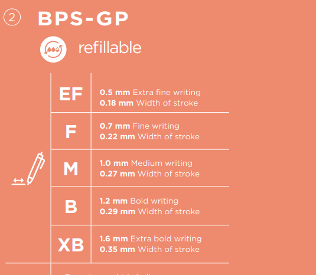

As a guy who likes notebooks, I never bothered about
pens that I use. Untill a few weeks ago, when I needed
to quickly write down something in my Moleskine Cahier,
and a pen I was using didn't want to write despite
it was full of ink.

I decided to buy a better pen, and bought a pack of
Pilot PBS-GP-F-L pens.

And they're just great. Write fine and **always**, very good.
