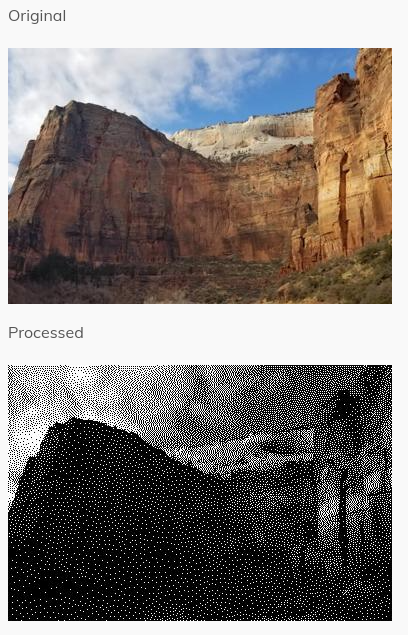
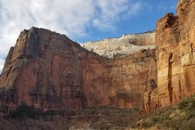
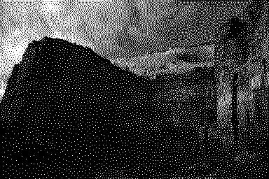
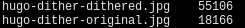

Yes, this site looks pretty ugly, considering my everyday job is to write (and
my favourite - delete) CSS and JS. I'm not a designer, but it wouldn't be so
hard to mimic popular UI patterns on my blog. So why it looks this way?

<!--more-->

It's the place where my frontend soul taking rest from my work. Let me explain.
The thing is that I like to think about any CSS and Javascript line of code as
of damage to the blank, raw, black-on-white web page. Sadly, industry likes
when you always add features (which, despite my best efforts, requires more
code), and doesn't like (in the best case it just doesn't care) when you're
doing something that doesn't ship new features, and it's equal to death when
you stop adding them.

Therefore, my daily job is to add code, which is the first frontend sin.

## Decisions

There's as little  CSS as possible to make the site look nice on mobile devices
plus a few color-related and decorating styles.

HTML markup is very simple. Again, because I don't use complex layout, I don't
need a lot of things to style.

I use hugo, so html minification is just as easy as this:

```
hugo --minify
```

That is, now all html markup in a generated website is minified.


## Plans

- Add pagination to the blog. I like when you can see all posts on a single
  page, but it looks nice only when you display only titles, without images or
  any post descriptions
- Use smaller images for post thumbnails in the posts list, or maybe dither
  original, full-sized images that are shown on a single post page. Dithering is
  not a silver bullet, though. The problem that I encountered is that sometimes you
  can get a dithered image being bigger than the original. Even in the hugo
  documentation section about dithering, a result image is bigger than
  original!

  

  Original image:

  

  Dithered image:

  

  Their size:

  

**But I like to change my blog instead of writing in it**, so I also plan to limit
CSS size to a certain bar - for example, 450 bytes, and then I can change the look
however I want while the max size is not exceeded.
